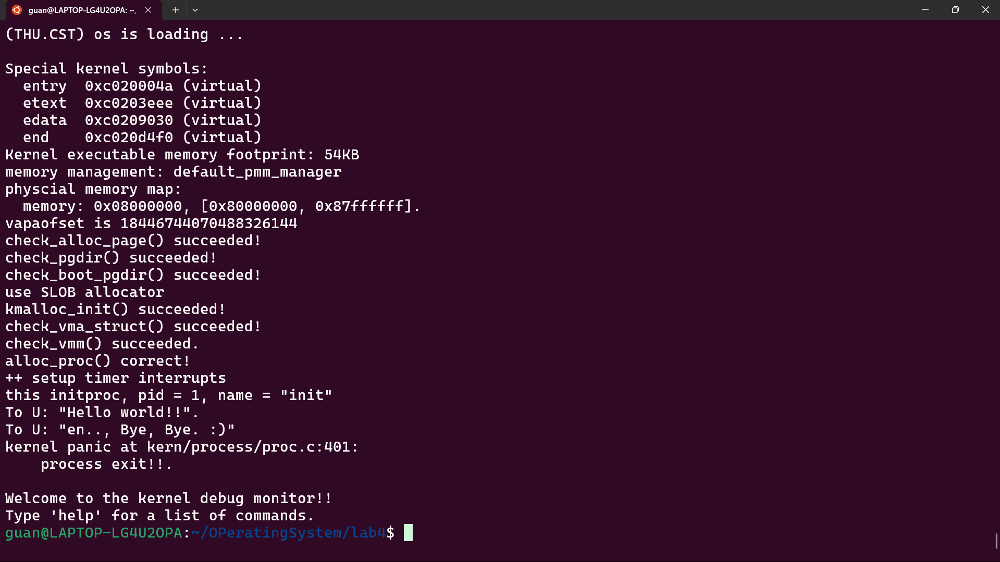
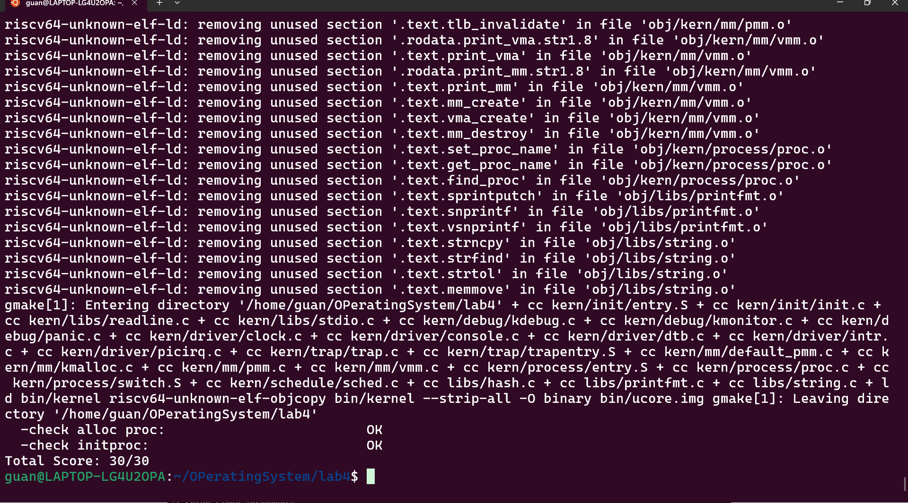

<h1 align="center" style="font-size: 44px"> 实验四：进程管理 </h1>

**小组成员：**

- 管一凡：2312307
- 周雨晴：2312313
- 欧一凡：2312826

**Github仓库地址：**https://github.com/Yifan-Guan/NKU_OS_2025_lab4.git

**说明：**

# 练习1：分配并初始化一个进程控制块

## 1.设计实现过程

alloc_proc 函数的目标是为即将创建的新进程（内核线程）分配一个进程控制块（struct proc_struct），并将其初始化到一个已知的、安全的“未初始化”状态。

- 成功分配内存后，使用 memset(proc, 0, sizeof(struct proc_struct)) 将整个结构体的内存块清零。
- 几个成员需要被设置为**特定的非零**初始值，以符合进程管理状态机的要求
  - 显式地将进程状态设置为 PROC_UNINIT（未初始化）
  - 将进程ID（PID）设置为一个无效值，用以表明该进程尚未被 get_pid() 分配一个有效的PID
  - 将页目录（pgdir）指向内核的页目录物理地址

## 2.说明proc_struct中和成员变量含义和在本实验中的作用

### 2.1 struct context context

- 变量含义

  - context中保存了进程执行的上下文，也就是几个关键的寄存器的值。这些寄存器的值用于在进程切换中还原之前进程的运行状态。
  - 与trapframe不同，它只保存内核态执行所需的最小寄存器集合。

- 作用

  - context 被 switch_to() 函数使用。

  - 当proc_run决定从进程A切换到进程B时，它会调用

    ```C
     switch_to(&A->context, &B->context)
    ```

  - switch_to 会：

    - 将当前CPU的寄存器保存到 A->context 中。
    - 从 B->context 中加载之前保存的寄存器到CPU。
    - 执行 ret 指令，跳转到 B->context 返回地址所指向的地址。

### 2.2 struct trapframe *tf

- 变量含义
  - tf里保存了进程的中断帧。
  - 当进程从用户空间跳进内核空间的时候，进程的执行状态被保存在了中断帧中（这里需要保存的执行状态数量不同于上下文切换）。
  - 系统调用可能会改变用户寄存器的值，我们可以通过调整中断帧来使得系统调用返回特定的值。
- 作用
  - 对于一个新创建的内核线程，它还没有“执行现场”。因此，我们需要伪造一个 trapframe，并将其放置在该线程的内核栈顶。
  - 这个 tf 中预设了线程的入口点和参数。当线程第一次被调度并“从中断返回”时，它会从这个伪造的 tf 中恢复寄存器，从而跳转到 kernel_thread_entry 开始执行。

# 练习2：为新创建的内核线程分配资源

## 1.设计实现过程

- 调用alloc_proc，首先获得一块用户信息块。
- 为进程分配一个内核栈。
- 复制原进程的内存管理信息到新进程（但内核线程不必做此事）
- 复制原进程上下文到新进程
- 将新进程添加到进程列表
- 唤醒新进程
- 返回新进程号

## 2.ucore是否做到给每个新fork的线程一个唯一的id？

- ucore做到了给每个新fork的线程一个唯一的ID。

- 分析和理由：这是通过 get_pid() 函数实现的。get_pid() 函数的核心逻辑如下：
  - 它使用一个静态变量 last_pid 来记录上一次分配的PID。
  - 每次调用时，它将 last_pid 加 1（如果超过 MAX_PID 则回绕到 1）。
  - **关键点：** 它并不会立即返回这个新的 last_pid，而是会遍历 proc_list（全局进程链表），检查这个 last_pid是否已经被某个现存的进程所占用。
  - 如果 proc->pid == last_pid，说明这个PID已被占用，get_pid() 会继续增加 last_pid 并重复遍历检查过程。
  - 直到它找到了一个在 proc_list 中不存在的 pid，它才会返回这个 pid。

# 练习3：编写proc_run 函数

## 1.在本实验的执行过程中，创建且运行了几个内核线程？

- 创建并运行了 2 个内核线程
- 第一个线程
  - idleproc = alloc_proc()：分配了第一个进程控制块。
  - 这个进程被手动初始化为PID 0，命名为 "idle"，并被设置current（当前运行）进程。
  - 这个线程会执行 cpu_idle() 函数，它是操作系统的空闲线程。

- 第二个线程
  - int pid = kernel_thread(init_main, "Hello world!!", 0);：proc_init 接着调用 kernel_thread 来创建第二个内核线程。
  - initproc = find_proc(pid); set_proc_name(initproc, "init");：这个新线程（PID 1）被命名为 "init"，它将执行 init_main 函数。

# 实验结果

执行make qemu后：



执行make grade后：



# 扩展练习 Challenge：

## 1. 说明语句`local_intr_save();` 与`local_intr_restore();`是如何实现开关中断的？

分析宏定义，两个宏定义中起主要作用的函数分别是`__intr_save()`与`__intr_restore()_`

```
#define local_intr_save(x) \
    do {                   \
        x = __intr_save(); \
    } while (0)

#define local_intr_restore(x) __intr_restore(x);
```

对于 `__intr_save()`函数

```
static inline bool __intr_save(void) {
    if (read_csr(sstatus) & SSTATUS_SIE) {
        intr_disable();
        return 1;
    }
    return 0;
}
```

其执行逻辑如下

- `read_csr(sstatus)`：读取RISC-V的`sstatus`（超级visor状态）寄存器
- `SSTATUS_SIE`：超级visor模式中断使能位掩码
- **判断**：如果当前中断是开启状态（`SSTATUS_SIE`位为1） 调用`intr_disable()`禁用中断 返回`1`表示之前中断是开启的
- 如果中断已经是关闭状态，直接返回`0`

对于`__intr_restore(bool flag)`函数

```
static inline void __intr_restore(bool flag) {
    if (flag) {
        intr_enable();
    }
}
```

其执行执行逻辑如下：

- 根据传入的`flag`参数决定是否重新开启中断
- 如果`flag`为`1`（表示之前中断是开启的），则调用`intr_enable()`重新开启中断
- 如果`flag`为`0`，什么也不做（保持中断关闭状态）

因此，关中断过程开始后，先检查`sstatus`寄存器中的`SSTATUS_SIE`位，将原中断状态保存到`intr_flag`变量中，如果原先是开启的，调用`intr_disable()`关闭中断。

开中断过程开始后，查看`intr_flag`中保存的原状态，如果原状态是开启时，才调用`intr_enable()`重新开启中断。

## 2. 深入理解不同分页模式的工作原理（思考题）

   get_pte()函数（位于`kern/mm/pmm.c`）用于在页表中查找或创建页表项，从而实现对指定线性地址对应的物理页的访问和映射操作。这在操作系统中的分页机制下，是实现虚拟内存与物理内存之间映射关系非常重要的内容。

**get_pte()函数中有两段形式类似的代码， 结合sv32，sv39，sv48的异同，解释这两段代码为什么如此相像？**

相似性原因：
- SV32/39/48都使用相同的PTE格式（PPN + 标志位），使得页表项的处理逻辑一致。
- 每一级页表的查找逻辑相同： 用虚拟地址的对应索引定位页表项 检查PTE_V有效位 如果不存在且需要创建，分配物理页并初始化

**目前get_pte()函数将页表项的查找和页表项的分配合并在一个函数里，你认为这种写法好吗？有没有必要把两个功能拆开？**

当前设计具有如下优点：

- **接口简洁**：用户只需一个函数调用
- **原子性保证**：查找和分配在同一个临界区内完成，避免竞态条件
- **性能优化**：减少函数调用开销，特别是多级页表需要递归处理时

若进行拆分，会有如下优点：

- **职责分离**：查找逻辑和分配逻辑解耦，更符合单一职责原则
- **错误处理更精细**：可以区分"页表项不存在"和"分配失败"两种不同情况
- **代码复用性**：纯查找功能可能在其他场景有用（如权限检查）

但同时，拆分也有缺点：

- **原子性问题**：拆分后需要额外的同步机制保证查找和分配的原子性
- **接口复杂度**：用户需要调用多个函数，使用更复杂
- **性能损失**：多一次函数调用，且需要重复的页表遍历

综上，我们认为当前设计更优，理由如下：

- **页表操作的本质需求**：在大多数使用场景中，如果页表项不存在，用户确实希望分配。拆分会强迫用户处理本可以自动处理的常见情况。
- **性能考虑**：页表操作是性能关键路径，合并减少了一次完整的页表遍历。
- **错误处理简化**：当前的`create`参数已经提供了足够的控制粒度： `create=0`：纯查找模式 `create=1`：查找或分配模式
- **实际使用模式**：查看代码中的使用情况： `// 大多数情况确实需要分配 page_insert() → get_pte(..., 1) // 少数只读情况 get_page() → get_pte(..., 0)`

所以，在当前操作系统上下文中，合并的设计是合理且实用的选择。


